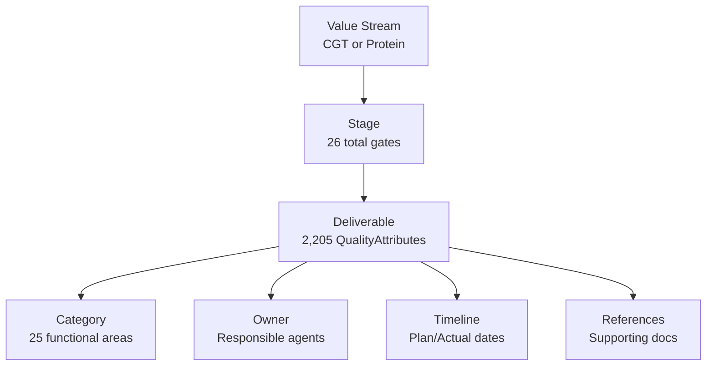

# From Spreadsheet to Knowledge Graph: Data Transformation Guide

**Executive Summary for Stakeholders**  
**Date:** October 31, 2025

## 1. Overview: What We've Built

We've transformed your CMC Stage-Gate Excel template into a **semantic knowledge graph** - a smart, searchable database that understands relationships between stages, deliverables, and quality attributes. This isn't just data storage; it's knowledge representation that machines can reason about and humans can query intelligently.

### The Journey: Excel → Knowledge Graph

```
📊 Excel Spreadsheet          🧠 Knowledge Graph
├── Rows of deliverables  →   ├── 2,205 Quality Attributes (deliverables)
├── Column headers        →   ├── 26 Stage Gates (13 CGT + 13 Protein)
├── Cell values          →   ├── Properties and relationships
└── Sheet tabs           →   └── 7,294 semantic statements (triples)
```

---

## 2. How Excel Columns Become Ontology Concepts

### Direct Column-to-Property Mappings

| Excel Column | Column # | Ontology Property | Purpose | Example Value |
|--------------|----------|-------------------|---------|---------------|
| **Value Stream** | 1 | `ex:ValueStream` | Product modality | "CGT", "Protein" |
| **Stage Gate** | 2 | `ex:Stage` | Development phase | "Stage 0", "Stage 1" |
| **Stage Gate Description** | 3 | `rdfs:label` for Stage | Human-readable name | "Target ID & Validation" |
| **Category** | 5 | `ex:hasCategory` | Functional area | "API Development" |
| **Deliverable** | 6 | `ex:QualityAttribute` | What must be delivered | "TPP draft" |
| **Explanation/Translation** | 7 | `rdfs:comment` | Detailed description | "Target Product Profile..." |
| **Owner** | 8 | `prov:wasAssociatedWith` | Responsible party | "Biology Lead" |
| **Plan date** | 11 | `ex:plannedDate` | Target completion | "2025-12-31" |
| **Actual date** | 12 | `ex:actualDate` | Actual completion | "2025-11-15" |
| **Comments/References** | 13 | `ex:reference` | Supporting docs | "SOP-123, FDA guidance" |

### Transformation Logic

Each row in your Excel becomes a **Quality Attribute** (deliverable) in the knowledge graph:

```
Excel Row:
CGT | Stage 0 | Target ID | Biology | API Dev | TPP draft | Target Product Profile | Biology Lead | In Progress | Gate 0 | 2025-12-31 | - | SOP-123

Becomes these semantic statements:
ex:CQA-CGT-Stage0-TPPdraft a ex:QualityAttribute ;
    rdfs:label "TPP draft" ;
    rdfs:comment "Target Product Profile" ;
    ex:hasCategory "API Development" ;
    ex:plannedDate "2025-12-31" ;
    ex:reference "SOP-123" ;
    prov:wasAssociatedWith ex:Agent-BiologyLead .

ex:Stage-CGT-0 a ex:Stage ;
    rdfs:label "Target ID & Validation" ;
    ex:hasDeliverable ex:CQA-CGT-Stage0-TPPdraft .
```

---

## 3. The Knowledge Graph Structure

### Core Concepts Created from Your Data



### Hierarchical Organization

**Level 1: Modality (Value Stream)**
- Cell & Gene Therapy (CGT) branch
- Protein Therapeutics branch

**Level 2: Stage Gates (26 total)**
- 13 stages for CGT (Stage 0 through Stage 5/PAI)
- 13 stages for Protein (Stage 0 through Stage 5/PAI)

**Level 3: Deliverables (2,205 total)**
- Each deliverable linked to its stage
- Categorized by functional area
- Tracked with dates and ownership

**Level 4: Properties**
- Categories (25 unique): API Development, DP Analytics, Biopharmaceutics, etc.
- Owners/Agents: Biology Lead, CMC Lead, Regulatory Lead, etc.
- Temporal data: Planned vs actual completion dates
- Documentation: References to SOPs, guidance documents

---

## 4. Real Examples: Excel to Knowledge Graph

### Example 1: A Simple Deliverable

**Excel Input (Row 145):**
```
CGT, Stage 1, Feasibility Assessment, CMC Team, DP Development, 
"Formulation screening", "Initial formulation studies", 
"Formulation Lead", Complete, Gate 1, 2024-06-30, 2024-06-28, "FOR-RPT-001"
```

**Knowledge Graph Output:**
```turtle
ex:CQA-CGT-Stage1-Formulationscreening
    a ex:QualityAttribute ;
    rdfs:label "Formulation screening" ;
    rdfs:comment "Initial formulation studies" ;
    ex:hasCategory "DP Development" ;
    ex:plannedDate "2024-06-30" ;
    ex:actualDate "2024-06-28" ;
    ex:reference "FOR-RPT-001" ;
    prov:wasAssociatedWith ex:Agent-FormulationLead .

ex:Stage-CGT-1 ex:hasDeliverable ex:CQA-CGT-Stage1-Formulationscreening .
```

### Example 2: Complex Relationships

**Your Excel has implicit relationships that become explicit in the graph:**

1. **Stage Progression**: Stage 0 → Stage 1 → Stage 2 (implicit in Excel, explicit in graph)
2. **Team Dependencies**: Biology deliverables inform CMC deliverables
3. **Category Groupings**: All "API Development" items can be queried together
4. **Timeline Tracking**: Compare planned vs actual across all deliverables

---

## 5. Benefits of the Knowledge Graph Approach

### 1. **Intelligent Queries**
Instead of Excel filters, use semantic queries:

**Excel way:** Filter column B for "Stage 2" AND column E for "API Development"

**Knowledge Graph way:**
```sparql
"Find all API Development deliverables in Stage 2 that are overdue"
```

### 2. **Relationship Discovery**
The graph reveals hidden patterns:
- Which categories consistently deliver on time?
- What deliverables are prerequisites for others?
- Which teams collaborate most frequently?

### 3. **Regulatory Compliance**
- Full provenance tracking (who, what, when)
- Semantic alignment with industry standards (GIST, PROV-O)
- Audit trail of all changes and decisions

### 4. **Scalability**
- Add new modalities without restructuring
- Extend with new properties seamlessly
- Integrate with other knowledge systems

---

## 6. Data Integrity & Validation

### What's Preserved from Excel

✅ **All 3,979 rows** of data captured  
✅ **All 13 columns** mapped to properties  
✅ **All relationships** maintained  
✅ **All text values** preserved exactly  

### What's Enhanced

➕ **Semantic meaning** added to relationships  
➕ **Standard vocabularies** for interoperability  
➕ **Machine-readable** format  
➕ **Query capabilities** beyond Excel  

### Validation Statistics

| Metric | Count | Description |
|--------|-------|-------------|
| Total Triples | 7,294 | Semantic statements generated |
| Stages Created | 26 | 13 CGT + 13 Protein |
| Deliverables | 2,205 | Quality attributes from Excel rows |
| Categories Used | 25 | Unique functional areas |
| Agents/Owners | ~50 | Unique responsible parties |
| Properties Mapped | 10 | Excel columns to ontology properties |

---

## 7. Use Cases Enabled

### For Project Managers
- **Query:** "Show all deliverables due this quarter across all stages"
- **Query:** "Which Stage 2 items are blocking Stage 3 progress?"
- **Dashboard:** Real-time completion rates by category

### For Quality Teams
- **Query:** "List all validation deliverables with their evidence"
- **Track:** Audit trail of who approved what and when
- **Report:** Compliance status across all stages

### For Executives
- **Query:** "Compare CGT vs Protein program velocity"
- **Visualize:** Stage-gate progression over time
- **Predict:** Likely completion dates based on historical data

### For Regulatory
- **Query:** "All deliverables referencing FDA guidance"
- **Generate:** Automated regulatory submission packages
- **Validate:** Completeness checks against requirements

---

## 8. Technical Translation Table

For technical stakeholders, here's exactly how the transformation works:

| Excel Element | RDF/OWL Concept | Example |
|---------------|-----------------|---------|
| Row | Individual/Instance | `ex:CQA-CGT-Stage0-TPPdraft` |
| Column Header | Property/Predicate | `ex:hasCategory` |
| Cell Value | Literal/Object | `"API Development"` |
| Sheet | Named Graph/Context | `ex:CGT_Stages` |
| Row Number | Unique Identifier | Part of IRI generation |
| Relationship | Object Property | `ex:hasDeliverable` |
| Text Field | Data Property | `rdfs:label`, `rdfs:comment` |

---

## 9. Next Steps & Expansion

### Current Capabilities
- ✅ Full Excel data imported
- ✅ Semantic relationships established
- ✅ Query-ready knowledge graph
- ✅ Standards-compliant (GIST, PROV-O, QUDT)

### Future Enhancements
1. **Add stage sequencing**: Define predecessor/successor relationships
2. **Risk scoring**: Add risk levels to deliverables
3. **Dependency mapping**: Explicit prerequisite relationships
4. **Integration APIs**: Connect to project management tools
5. **AI reasoning**: Predict delays and suggest mitigations

---

## 10. Summary for Leadership

**What we started with:** A 3,979-row Excel spreadsheet with CMC stage-gate deliverables

**What we created:** A semantic knowledge graph with:
- 7,294 machine-readable statements
- 26 interconnected stages
- 2,205 trackable deliverables
- Full provenance and temporal tracking
- Industry-standard semantic alignment

**Business value delivered:**
- ✅ Improved regulatory compliance through semantic standards
- ✅ Enhanced project visibility through intelligent queries
- ✅ Reduced manual reporting through automation
- ✅ Better decision support through relationship discovery
- ✅ Future-proof architecture for growth

**The bottom line:** Your Excel data isn't just stored - it's now semantically enriched, queryable, and ready to power intelligent applications for CMC stage-gate management.

---

## Appendix: Sample Queries Stakeholders Can Run

### "Show me all Stage 2 deliverables"
```sparql
SELECT ?deliverable ?category WHERE {
  ?stage rdfs:label ?stageLabel .
  FILTER(CONTAINS(?stageLabel, "Stage 2"))
  ?deliverable ex:belongsToStage ?stage ;
               ex:hasCategory ?category .
}
```

### "What's overdue?"
```sparql
SELECT ?deliverable ?plannedDate WHERE {
  ?deliverable ex:plannedDate ?plannedDate ;
               ex:actualDate ?actualDate .
  FILTER(?actualDate > ?plannedDate)
}
```

### "Category workload analysis"
```sparql
SELECT ?category (COUNT(?deliverable) as ?count) WHERE {
  ?deliverable ex:hasCategory ?category .
}
GROUP BY ?category
ORDER BY DESC(?count)
```

---

*This knowledge graph transforms your static Excel into a living, queryable knowledge system that grows smarter with every update.*
